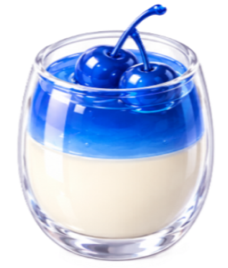
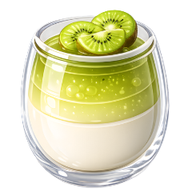
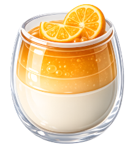
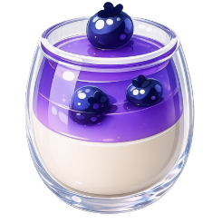
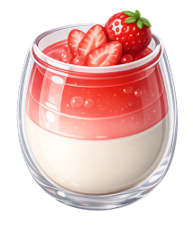

# 🌀 Sweet Swirl

Sweet Swirl is a simple web-based grid-matching game where the user swaps two adjacent dessert ojects to match 3 or more similar-like dessert objects on the gameboard to earn points.


## 🛠️ Tech Stack
* **Frontend:** React (JSX), JavaScript (ES6+)
* **Build Tool:** Vite
* **Styling:** CSS3 (Custom Layouts & Flexbox)


## 🎨 Asset Directory
The desserts that make up the basic elements of the game includes:

| Icon | Description |
| :---: | :--- |
|  | Blue cherry cup|
| |Green Kiwi cup|
||Orange slice cup|
||Pink Candy cup|
||Purple Blueberry cup|
||Red Strawberry cup| 
||White cream cup|

The custom icons used across this game were generated using AI and are stored in `./src/assets/`:

## 🚀 Features
* **Dynamic 8x8 Game Board:** A perfectly proportioned grid layout utilizing responsive Flexbox/Grid mechanics.
* **Real-Time Score Tracking:** Integrated score-board interface that updates instantly as candy matches are cleared.
* **Custom Theme Design:** Features custom, high-quality sweet/fruity icons and themed backing visual assets created via generative AI.
* **Component-Driven Architecture:** Built entirely using React state to manage item arrays, square identities, and color states cleanly.


## 💻 Getting Started

Follow these simple steps to get a local copy up and running on your machine.

### Prerequisites
Make sure you have [Node.js](https://nodejs.org) installed.

### Installation & Setup

1. **Clone or download** this repository to your local machine.
2. Open your terminal inside the project folder and **install dependencies**:
   ```bash
   npm install
   ```

3. **Start the local development server**:
   ```bash
   npm run dev
   ```

4. Open your browser and navigate to the local link provided in your terminal (usually `http://localhost:5173`).

## 📜 License
Distributed under the MIT License.

<br>

---
**Developer Note:**
This project is a small project apart of my reconnecting to Javascript series.
